# Hands on Lab: Alfresco On-prem to Cloud-Ready

By the end of this lab, you should be able to:

1. Stand up ACS 25 Enterprise incrementally with Docker Compose
2. Compare Solr and OpenSearch search topologies
3. Compare local transform (`transform-core-aio`) and full ATS async topology
4. Restore on-prem data/configuration into containers
5. Reindex search from scratch for migration
6. Apply local security hardening with TLS 1.3
7. Prepare custom images for Kubernetes using Alfresco Dockerfiles Bakery

## Pre-Lab Checklist

Before starting, ensure:

1. Docker Engine and Docker Compose are installed
2. You can pull required images from `quay.io` and `docker.io`
3. You have Enterprise credentials/license access where required
4. You have a baseline on-prem VM (Alfresco 23.3 Community) for migration exercises

Optional checks:

```bash
docker --version
docker compose version
```

## Stage Overview

| Stage | File | Focus |
|---|---|---|
| `01-repo` | `stages/01-repo/compose.yaml` | Repository + PostgreSQL (no search) |
| `02-repo-search-solr` | `stages/02-repo-search-solr/compose.yaml` | Legacy Solr search topology |
| `03-repo-search-opensearch` | `stages/03-repo-search-opensearch/compose.yaml` | OpenSearch search topology + reindex |
| `04-repo-search-opensearch-transform-aio` | `stages/04-repo-search-opensearch-transform-aio/compose.yaml` | Add direct `transform-core-aio` |
| `05-repo-search-opensearch-transform-ats` | `stages/05-repo-search-opensearch-transform-ats/compose.yaml` | Switch to ATS async transform (ActiveMQ + SFS + T-Router) |
| `06-full-stack` | `stages/06-full-stack/compose.yaml` | Add ADW + Share |
| `07-full-stack-proxy` | `stages/07-full-stack-proxy/compose.yaml` | Add reverse proxy |
| `08-best-practices` | `stages/08-best-practices/compose.yaml` | Healthchecks/resources/depends_on patterns |
| `09-addons` | `stages/09-addons/compose.yaml` | Build custom repo/share images with addons |
| `10-restore-onprem` | `stages/10-restore-onprem/compose.yaml` | Restore DB/files/config + reindex flow |
| `11-security-local` | `stages/11-security-local/compose.yaml` | Local TLS 1.3 hardening |
| `12-k8s-image-bakery` | `stages/12-k8s-image-bakery/README.md` | Build and publish K8s images |

## Detailed Guides (Use During Lab)

- Stage 09 Addons: [stages/09-addons/ADDONS.md](stages/09-addons/ADDONS.md)
- Stage 10 Restore: [stages/10-restore-onprem/RESTORE.md](stages/10-restore-onprem/RESTORE.md)
- Stage 11 Security: [stages/11-security-local/SECURITY.md](stages/11-security-local/SECURITY.md)
- Stage 12 Bakery: [stages/12-k8s-image-bakery/README.md](stages/12-k8s-image-bakery/README.md)

## How to Move Between Stages

If you run stages sequentially on one VM, stop the current stage before starting the next one to avoid port conflicts:

```bash
# Example: stop Stage 05
docker compose --env-file .env -f stages/05-repo-search-opensearch-transform-ats/compose.yaml down
```

Then start the next stage.

## Walkthrough

### Step 1 - Stage 01 (Repository + PostgreSQL)

> Docker Compose baseline directives `services`, `image`, `environment`, `depends_on`, `ports`, and `volumes`.


Start

```bash
docker compose --env-file .env -f stages/01-repo/compose.yaml up
```

Validate DB

```bash
docker compose --env-file .env -f stages/01-repo/compose.yaml exec -T postgres \
  sh -c 'pg_isready -d "$POSTGRES_DB" -U "$POSTGRES_USER"'
```

expected

```
/var/run/postgresql:5432 - accepting connections
```

Validate Repository

```bash
curl -f http://localhost:8080/alfresco/api/-default-/public/alfresco/versions/1/probes/-ready-
```

expected

```json
{"entry":{"message":"readyProbe: Success - Tested"}}
```

### Step 2 - Stage 02 (Legacy Solr Search)

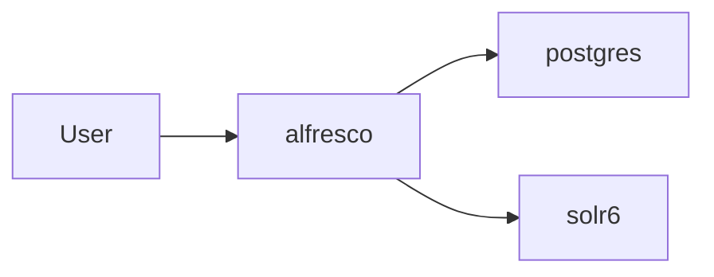

Start

```bash
docker compose --env-file .env -f stages/01-repo/compose.yaml down
docker compose --env-file .env -f stages/02-repo-search-solr/compose.yaml up
```

Validate DB and Repository (instructions above)

Validate Search

```bash
curl -H "X-Alfresco-Search-Secret: secret" \
  "http://localhost:8983/solr/alfresco/select?q=*&rows=1&wt=json"
```

expected

```json
{ "responseHeader":
  {"status":0,"QTime":61,"params":
    {"q":"*","rows":"1","wt":"json"}
  },
  ...
}
```

Validate Search (Alfresco API)

```bash
curl -u "admin:admin" \
  -H "Content-Type: application/json" \
  -d '{"query":{"query":"test"},"paging":{"maxItems":1,"skipCount":0}}' \
  "http://localhost:8080/alfresco/api/-default-/public/search/versions/1/search"
```

expected

```json
{
  "list": {
    "pagination": { "count": 0, ... },
    "entries": [ ... ]
  }
}
```

### Step 3 - Stage 03 (Switch to OpenSearch)

> Docker Compose introduces `healthcheck`, conditional `depends_on` (`condition: ...`), and `restart: on-failure:5` for the one-shot reindex job.

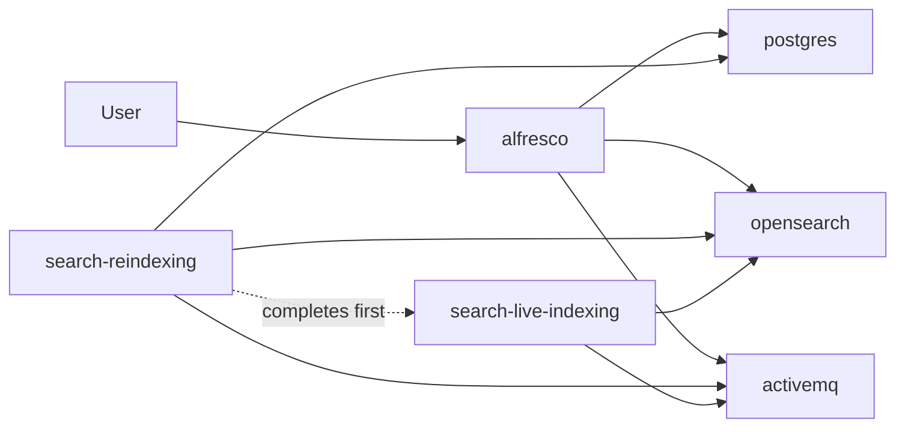

**Start**

```bash
docker compose --env-file .env -f stages/02-repo-search-solr/compose.yaml down
docker compose --env-file .env -f stages/03-repo-search-opensearch/compose.yaml up
```

Validate DB and Repository (instructions above)

Validate Search

```bash
curl -u "admin:admin" \
  -H "Content-Type: application/json" \
  -d '{"query":{"query":"test"},"paging":{"maxItems":1,"skipCount":0}}' \
  "http://localhost:8080/alfresco/api/-default-/public/search/versions/1/search"
```

expected

```json
{
  "list": {
    "pagination": { "count": 0, ... },
    "entries": [ ... ]
  }
}
```

### Step 4 - Stage 04 (Direct Transform Core AIO)

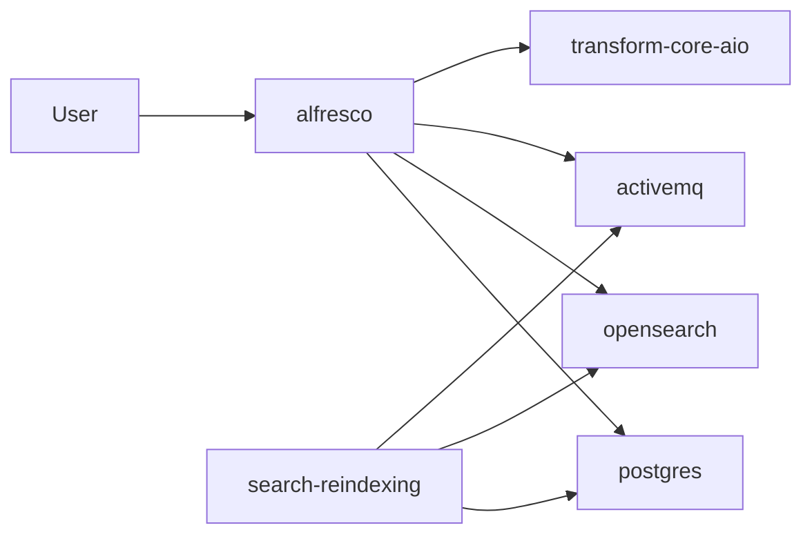

**Start**

```bash
docker compose --env-file .env -f stages/03-repo-search-opensearch/compose.yaml down
docker compose --env-file .env -f stages/04-repo-search-opensearch-transform-aio/compose.yaml up
```

**Validate (Repo + DB + OpenSearch + ActiveMQ + Transform Core AIO)**

```bash
docker compose --env-file .env -f stages/04-repo-search-opensearch-transform-aio/compose.yaml ps \
  postgres alfresco opensearch activemq transform-core-aio search-reindexing search-live-indexing
docker compose --env-file .env -f stages/04-repo-search-opensearch-transform-aio/compose.yaml exec -T postgres \
  sh -c 'pg_isready -d "$POSTGRES_DB" -U "$POSTGRES_USER"'
curl -f http://localhost:${REPO_HTTP_PORT}/alfresco/api/-default-/public/alfresco/versions/1/probes/-ready-
docker compose --env-file .env -f stages/04-repo-search-opensearch-transform-aio/compose.yaml exec -T opensearch \
  curl -fsS http://localhost:9200/_cluster/health
curl -f http://localhost:${ACTIVEMQ_WEB_PORT}
```

### Step 5 - Stage 05 (Switch to ATS Async Transform)

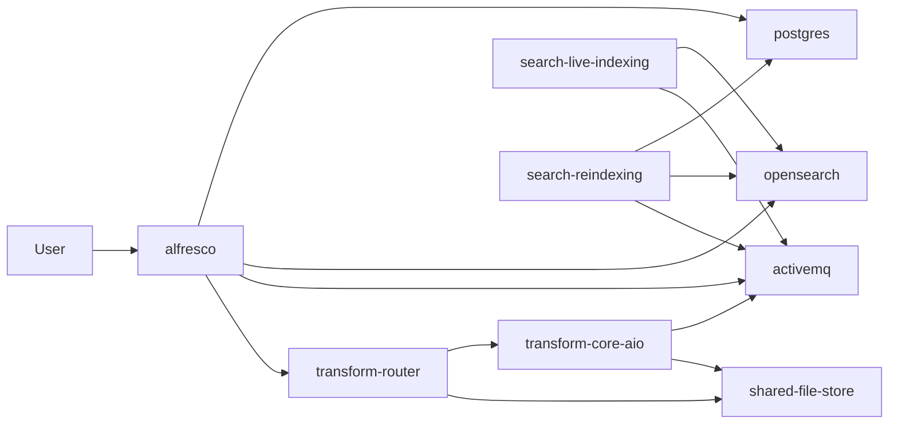

**Start**

```bash
docker compose --env-file .env -f stages/04-repo-search-opensearch-transform-aio/compose.yaml down
docker compose --env-file .env -f stages/05-repo-search-opensearch-transform-ats/compose.yaml up -d
```

**Validate (Repo + DB + OpenSearch + ATS services)**

```bash
docker compose --env-file .env -f stages/05-repo-search-opensearch-transform-ats/compose.yaml ps \
  postgres alfresco opensearch activemq shared-file-store transform-core-aio transform-router \
  search-live-indexing search-reindexing
docker compose --env-file .env -f stages/05-repo-search-opensearch-transform-ats/compose.yaml exec -T postgres \
  sh -c 'pg_isready -d "$POSTGRES_DB" -U "$POSTGRES_USER"'
curl -f http://localhost:${REPO_HTTP_PORT}/alfresco/api/-default-/public/alfresco/versions/1/probes/-ready-
docker compose --env-file .env -f stages/05-repo-search-opensearch-transform-ats/compose.yaml exec -T opensearch \
  curl -fsS http://localhost:9200/_cluster/health
curl -f http://localhost:${ACTIVEMQ_WEB_PORT}
```

### Step 6 - Stage 06 (Full Stack Without Proxy)

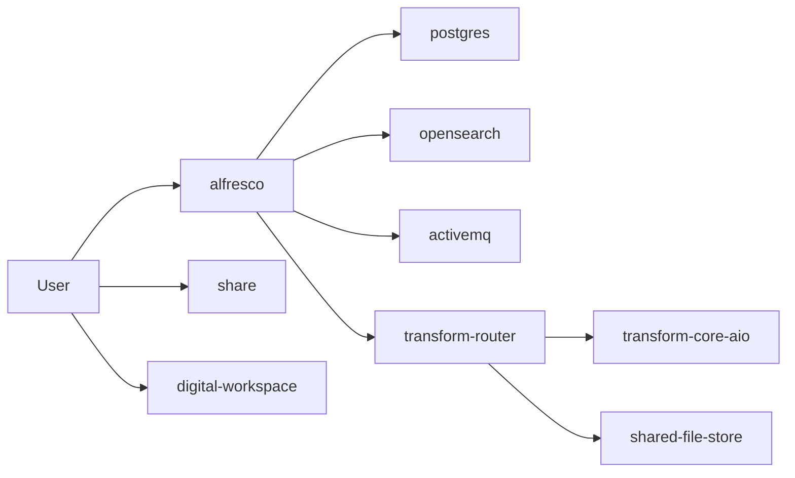

**Start**

```bash
docker compose --env-file .env -f stages/05-repo-search-opensearch-transform-ats/compose.yaml down
docker compose --env-file .env -f stages/06-full-stack/compose.yaml up -d
```

**Validate (Repo + DB + Search + Transform + UI)**

```bash
docker compose --env-file .env -f stages/06-full-stack/compose.yaml ps \
  postgres alfresco opensearch activemq transform-router transform-core-aio \
  shared-file-store search-live-indexing search-reindexing digital-workspace share
docker compose --env-file .env -f stages/06-full-stack/compose.yaml exec -T postgres \
  sh -c 'pg_isready -d "$POSTGRES_DB" -U "$POSTGRES_USER"'
curl -f http://localhost:${REPO_HTTP_PORT}/alfresco/api/-default-/public/alfresco/versions/1/probes/-ready-
docker compose --env-file .env -f stages/06-full-stack/compose.yaml exec -T opensearch \
  curl -fsS http://localhost:9200/_cluster/health
curl -f http://localhost:${ADW_HTTP_PORT}/
curl -f http://localhost:${SHARE_HTTP_PORT}/share
```

### Step 7 - Stage 07 (Add Reverse Proxy)

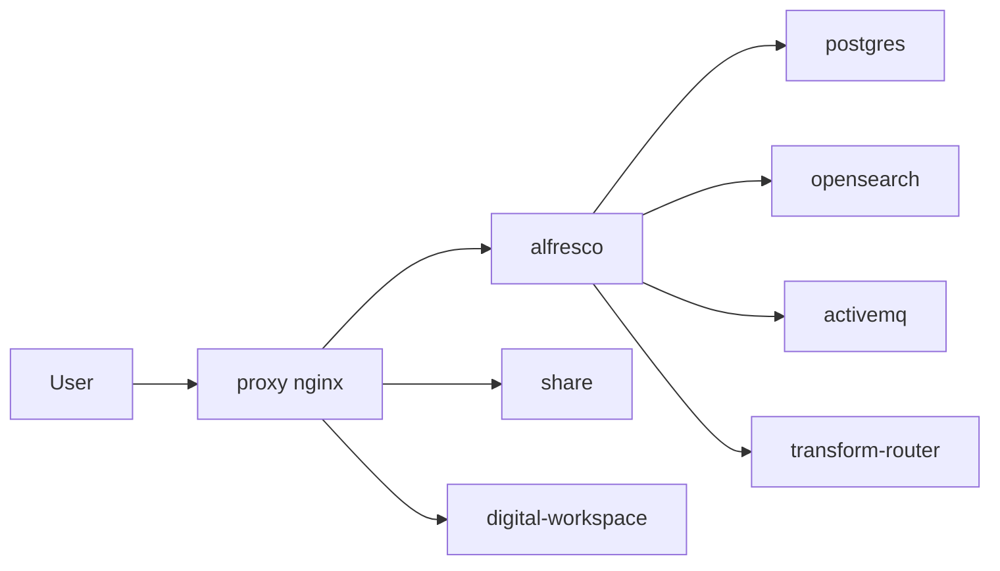

**Start**

```bash
docker compose --env-file .env -f stages/06-full-stack/compose.yaml down
docker compose --env-file .env -f stages/07-full-stack-proxy/compose.yaml up -d
```

**Validate (Previous services + Proxy)**

```bash
docker compose --env-file .env -f stages/07-full-stack-proxy/compose.yaml ps \
  postgres alfresco opensearch activemq transform-router transform-core-aio \
  shared-file-store search-live-indexing search-reindexing digital-workspace share proxy
docker compose --env-file .env -f stages/07-full-stack-proxy/compose.yaml exec -T postgres \
  sh -c 'pg_isready -d "$POSTGRES_DB" -U "$POSTGRES_USER"'
docker compose --env-file .env -f stages/07-full-stack-proxy/compose.yaml exec -T opensearch \
  curl -fsS http://localhost:9200/_cluster/health
curl -f http://localhost:${PROXY_HTTP_PORT}/alfresco/api/-default-/public/alfresco/versions/1/probes/-ready-
curl -f http://localhost:${PROXY_HTTP_PORT}/workspace
curl -f http://localhost:${PROXY_HTTP_PORT}/share
```

### Step 8 - Stage 08 (Best-Practice Runtime Controls)

> Docker Compose introduces `deploy.resources`, `restart`, broader `healthcheck` usage, `depends_on` with `service_healthy`, plus host/runtime directives `command`, `ulimits`, and `cap_add`.

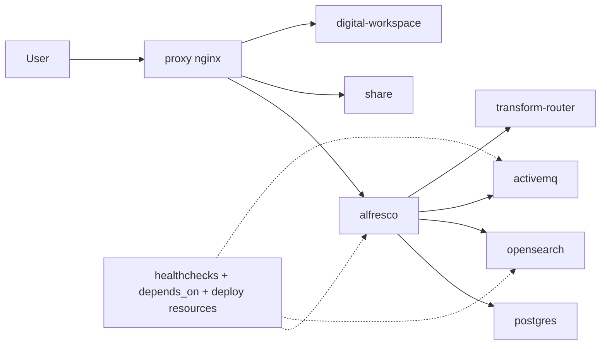

**Start**

```bash
docker compose --env-file .env -f stages/07-full-stack-proxy/compose.yaml down
docker compose --env-file .env -f stages/08-best-practices/compose.yaml up -d
```

**Validate (Same services, now with healthchecks/resources/dependencies)**

```bash
docker compose --env-file .env -f stages/08-best-practices/compose.yaml ps
docker compose --env-file .env -f stages/08-best-practices/compose.yaml exec -T postgres \
  sh -c 'pg_isready -d "$POSTGRES_DB" -U "$POSTGRES_USER"'
docker compose --env-file .env -f stages/08-best-practices/compose.yaml exec -T opensearch \
  curl -fsS http://localhost:9200/_cluster/health
curl -f http://localhost:${PROXY_HTTP_PORT}/alfresco/api/-default-/public/alfresco/versions/1/probes/-ready-
curl -f http://localhost:${PROXY_HTTP_PORT}/workspace
curl -f http://localhost:${PROXY_HTTP_PORT}/share
```

### Step 9 - Stage 09 (Install Addons)

> Docker Compose introduces `build` (`context`, `dockerfile`, `args`) for custom addon images.

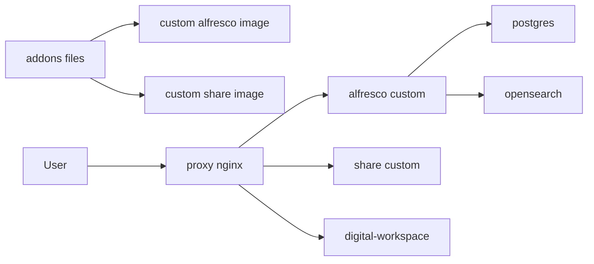

Follow [stages/09-addons/ADDONS.md](stages/09-addons/ADDONS.md), then:

**Start**

```bash
cd stages/09-addons
../../shared/fetch-addons.sh
cd ../..
docker compose --env-file .env -f stages/08-best-practices/compose.yaml down
docker compose --env-file .env -f stages/09-addons/compose.yaml up -d --build
```

**Validate (Previous services + custom addon images)**

```bash
docker compose --env-file .env -f stages/09-addons/compose.yaml ps
docker compose --env-file .env -f stages/09-addons/compose.yaml exec -T postgres \
  sh -c 'pg_isready -d "$POSTGRES_DB" -U "$POSTGRES_USER"'
docker compose --env-file .env -f stages/09-addons/compose.yaml exec -T opensearch \
  curl -fsS http://localhost:9200/_cluster/health
docker image ls --format '{{.Repository}}:{{.Tag}}' | grep -E 'local/alfresco-content-repository-addons|local/alfresco-share-addons'
curl -f http://localhost:${PROXY_HTTP_PORT}/alfresco/api/-default-/public/alfresco/versions/1/probes/-ready-
curl -f http://localhost:${PROXY_HTTP_PORT}/workspace
curl -f http://localhost:${PROXY_HTTP_PORT}/share
```

### Step 10 - Stage 10 (Restore On-Prem Data and Reindex)

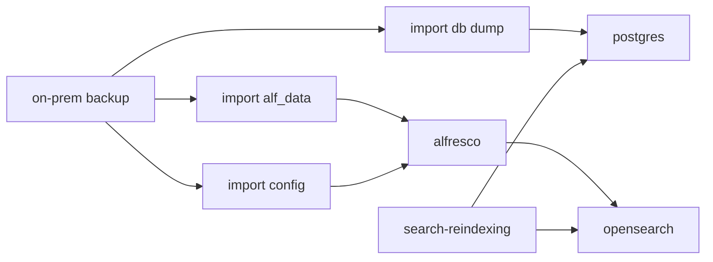

Use:

- [stages/10-restore-onprem/RESTORE.md](stages/10-restore-onprem/RESTORE.md)
- [alfresco-ubuntu-installer backup/restore reference](https://github.com/aborroy/alfresco-ubuntu-installer/blob/main/README.md#backup-and-restore)

Then:

**Start**

```bash
docker compose --env-file .env -f stages/09-addons/compose.yaml down
docker compose --env-file .env -f stages/10-restore-onprem/compose.yaml up -d --build
```

**Validate (Restored DB/content/config + full stack)**

```bash
docker compose --env-file .env -f stages/10-restore-onprem/compose.yaml ps
docker compose --env-file .env -f stages/10-restore-onprem/compose.yaml exec -T postgres \
  sh -c 'pg_isready -d "$POSTGRES_DB" -U "$POSTGRES_USER"'
docker compose --env-file .env -f stages/10-restore-onprem/compose.yaml exec -T opensearch \
  curl -fsS http://localhost:9200/_cluster/health
curl -f http://localhost:${PROXY_HTTP_PORT}/alfresco/api/-default-/public/alfresco/versions/1/probes/-ready-
curl -f http://localhost:${PROXY_HTTP_PORT}/workspace
curl -f http://localhost:${PROXY_HTTP_PORT}/share
```

### Step 11 - Stage 11 (Local Security Hardening)

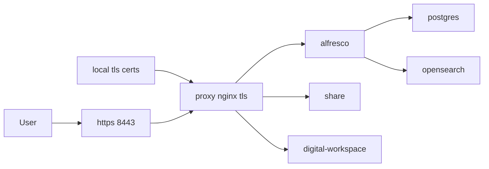

Use [stages/11-security-local/SECURITY.md](stages/11-security-local/SECURITY.md), then:

**Start**

```bash
cd stages/11-security-local
NGINX_SERVER_NAME=localhost ./generate-certs.sh
cd ../..
docker compose --env-file .env -f stages/10-restore-onprem/compose.yaml down
docker compose --env-file .env -f stages/11-security-local/compose.yaml up -d --build
```

**Validate (Previous services + TLS)**

```bash
docker compose --env-file .env -f stages/11-security-local/compose.yaml ps
docker compose --env-file .env -f stages/11-security-local/compose.yaml exec -T postgres \
  sh -c 'pg_isready -d "$POSTGRES_DB" -U "$POSTGRES_USER"'
docker compose --env-file .env -f stages/11-security-local/compose.yaml exec -T opensearch \
  curl -fsS http://localhost:9200/_cluster/health
curl -k -f https://localhost:${PROXY_HTTPS_PORT}/alfresco/api/-default-/public/alfresco/versions/1/probes/-ready-
curl -I http://localhost:${PROXY_HTTP_PORT} | head -n 1
openssl s_client -connect localhost:${PROXY_HTTPS_PORT} -tls1_3
```

### Step 12 - Stage 12 (Kubernetes Image Bakery Handoff)

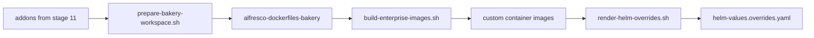

Use [stages/12-k8s-image-bakery/README.md](stages/12-k8s-image-bakery/README.md), then:

**Start**

```bash
cd stages/12-k8s-image-bakery
set -a; source ./bakery.env; set +a
./scripts/prepare-bakery-workspace.sh --bakery-dir "$BAKERY_DIR"
./scripts/build-enterprise-images.sh --env-file ./bakery.env
./scripts/render-helm-overrides.sh --env-file ./bakery.env
```

**Validate (Build artifacts for Kubernetes handoff)**

```bash
test -f ./helm-values.overrides.yaml && echo "helm overrides generated"
```

## Notes

- Stage 02 (Solr) is included to cover legacy search topology in training.
- Stage 03+ is the OpenSearch path aligned with ACS 25 migration goals.
- Stage 04 vs Stage 05 separates direct core-aio from full ATS async orchestration.

## References

- [alfresco-incremental-deployment](https://github.com/aborroy/alfresco-incremental-deployment)
- [alfresco-docker-best-practices](https://github.com/aborroy/alfresco-docker-best-practices)
- [alfresco-opensearch-deployer](https://github.com/aborroy/alfresco-opensearch-deployer)
- [alfresco-ubuntu-installer](https://github.com/aborroy/alfresco-ubuntu-installer)
- [alfresco-extension-inspector](https://github.com/Alfresco/alfresco-extension-inspector)
- [alf-tengine-xml](https://github.com/aborroy/alf-tengine-xml)
- [alf-tengine-ocr](https://github.com/aborroy/alf-tengine-ocr)
- [alf-k8s](https://github.com/aborroy/alf-k8s)
- [alfresco-dockerfiles-bakery](https://github.com/Alfresco/alfresco-dockerfiles-bakery)
