# Hands on Lab: Alfresco On-prem to Cloud-Ready

By the end of this lab, you should be able to:

1. Stand up ACS 25 Enterprise incrementally with Docker Compose
2. Compare Solr and OpenSearch search topologies
3. Compare local transform (`transform-core-aio`) and full ATS async topology
4. Restore on-prem data/configuration into containers
5. Reindex search from scratch for migration
6. Apply local security hardening with TLS 1.3
7. Prepare custom images for Kubernetes using Alfresco Dockerfiles Bakery

## Pre-Lab Checklist

Before starting, ensure:

1. Docker Engine and Docker Compose are installed
2. You can pull required images from `quay.io` and `docker.io`
3. You have Enterprise credentials/license access where required
4. You have a baseline on-prem VM (Alfresco 23.3 Community) for migration exercises

Optional checks:

```bash
docker --version
docker compose version
```

## Stage Overview

| Stage (Learning Sequence) | Compose File | Focus |
|---|---|---|
| `01-repo` | `stages/01-repo/compose.yaml` | Repository + PostgreSQL (no search) |
| `02-transform-core-aio` | `stages/02-transform-core-aio/compose.yaml` | Add Transform Core AIO (no search yet) |
| `03-transform-service-ats` | `stages/03-transform-service-ats/compose.yaml` | Add ATS async transform (no search yet) |
| `04-solr-search-with-ats` | `stages/04-solr-search-with-ats/compose.yaml` | Add Solr search on top of ATS (content indexing path) |
| `05-opensearch-migration-with-ats` | `stages/05-opensearch-migration-with-ats/compose.yaml` | Migrate Solr -> OpenSearch with reindex + live indexing (content) |
| `06-full-stack` | `stages/06-full-stack/compose.yaml` | Add ADW + Share |
| `07-full-stack-proxy` | `stages/07-full-stack-proxy/compose.yaml` | Add reverse proxy |
| `08-best-practices` | `stages/08-best-practices/compose.yaml` | Healthchecks/resources/depends_on patterns |
| `09-addons` | `stages/09-addons/compose.yaml` | Build custom repo/share images with addons |
| `10-restore-onprem` | `stages/10-restore-onprem/compose.yaml` | Restore DB/files/config + reindex flow |
| `11-security-local` | `stages/11-security-local/compose.yaml` | Local TLS 1.3 hardening |
| `12-k8s-image-bakery` | `stages/12-k8s-image-bakery/README.md` | Build and publish K8s images |

## Detailed Guides (Use During Lab)

- Stage 09 Addons: [stages/09-addons/ADDONS.md](stages/09-addons/ADDONS.md)
- Stage 10 Restore: [stages/10-restore-onprem/RESTORE.md](stages/10-restore-onprem/RESTORE.md)
- Stage 10 Addons: [stages/10-restore-onprem/ADDONS.md](stages/10-restore-onprem/ADDONS.md)
- Stage 11 Security: [stages/11-security-local/SECURITY.md](stages/11-security-local/SECURITY.md)
- Stage 12 Bakery: [stages/12-k8s-image-bakery/README.md](stages/12-k8s-image-bakery/README.md)

## How to Move Between Stages

If you run stages sequentially on one VM, stop the current stage before starting the next one to avoid port conflicts:

```bash
# Example: stop Stage 05
docker compose --env-file .env -f stages/05-opensearch-migration-with-ats/compose.yaml down
```

Then start the next stage.

## Walkthrough

### Step 1 - Stage 01 (Repository + PostgreSQL)

> Docker Compose baseline directives [`services`](https://docs.docker.com/reference/compose-file/services/), [`image`](https://docs.docker.com/reference/compose-file/services/#image), [`environment`](https://docs.docker.com/reference/compose-file/services/#environment), [`depends_on`](https://docs.docker.com/reference/compose-file/services/#depends_on), [`ports`](https://docs.docker.com/reference/compose-file/services/#ports), and [`volumes`](https://docs.docker.com/reference/compose-file/services/#volumes).


Start

```bash
docker compose --env-file .env -f stages/01-repo/compose.yaml up
```

Validate DB

```bash
docker compose --env-file .env -f stages/01-repo/compose.yaml exec -T postgres \
  sh -c 'pg_isready -d "$POSTGRES_DB" -U "$POSTGRES_USER"'
```

expected

```
/var/run/postgresql:5432 - accepting connections
```

Validate Repository

```bash
curl -f http://localhost:8080/alfresco/api/-default-/public/alfresco/versions/1/probes/-ready-
```

expected

```json
{"entry":{"message":"readyProbe: Success - Tested"}}
```

### Step 2 - Stage 02 (Transform Core AIO)

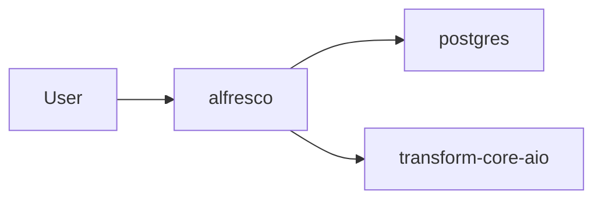

Start

```bash
docker compose --env-file .env -f stages/01-repo/compose.yaml down
docker compose --env-file .env -f stages/02-transform-core-aio/compose.yaml up
```

Validate DB and Repository (instructions above)

Validate Transform

```bash
docker compose --env-file .env -f stages/02-transform-core-aio/compose.yaml exec -T transform-core-aio \
  curl -f http://localhost:8090/ready
```

expected

```text
transform-core-aio is Up, and /ready returns HTTP 200
```

### Step 3 - Stage 03 (Transform Service ATS)

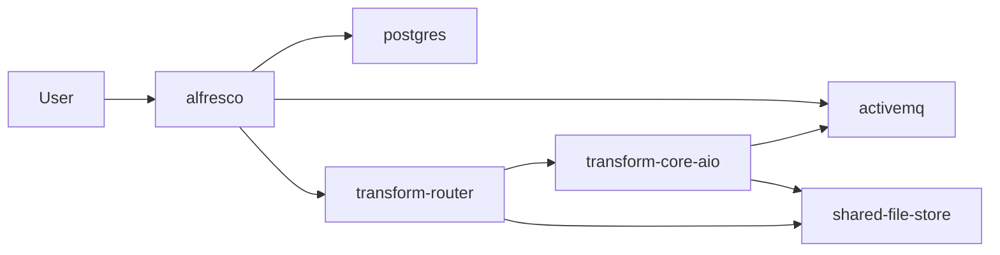

**Start**

```bash
docker compose --env-file .env -f stages/02-transform-core-aio/compose.yaml down
docker compose --env-file .env -f stages/03-transform-service-ats/compose.yaml up
```

Validate DB and Repository (instructions above)

Validate Transform (new in this step: ATS async)

```bash
curl -f http://localhost:8161
docker compose --env-file .env -f stages/03-transform-service-ats/compose.yaml exec -T shared-file-store \
  curl -f http://localhost:8099/ready
docker compose --env-file .env -f stages/03-transform-service-ats/compose.yaml exec -T transform-router \
  curl -f http://localhost:8095/actuator/health
```

expected

```text
ATS services are Up, ActiveMQ web is reachable, and SFS/T-Router health endpoints return HTTP 200
```

### Step 4 - Stage 04 (Solr Search With ATS Content)

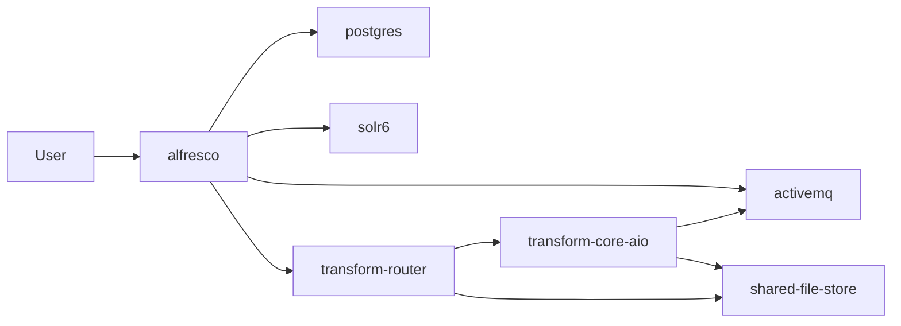

**Start**

```bash
docker compose --env-file .env -f stages/03-transform-service-ats/compose.yaml down
docker compose --env-file .env -f stages/04-solr-search-with-ats/compose.yaml up
```

Validate DB and Repository (instructions above)

Validate Transform (instructions above)

Validate Search (new in this step)

```bash
curl -H "X-Alfresco-Search-Secret: secret" \
  "http://localhost:8983/solr/alfresco/select?q=*&rows=1&wt=json"
curl -u "admin:admin" \
  -H "Content-Type: application/json" \
  -d '{"query":{"query":"test"},"paging":{"maxItems":1,"skipCount":0}}' \
  "http://localhost:8080/alfresco/api/-default-/public/search/versions/1/search"
```

expected

```json
{ "responseHeader": {"status": 0, ...}, ... }
```

```json
{
  "list": {
    "pagination": { "count": ..., ... },
    "entries": [ ... ]
  }
}
```

### Step 5 - Stage 05 (Migrate Solr to OpenSearch With ATS Content)

> Docker Compose introduces [`healthcheck`](https://docs.docker.com/reference/compose-file/services/#healthcheck), conditional [`depends_on`](https://docs.docker.com/reference/compose-file/services/#depends_on) (`condition: ...`), and [`restart`](https://docs.docker.com/reference/compose-file/services/#restart) (`on-failure:5`) for the reindex/live-indexing sequence.
> OpenSearch indexing scope from this step onward: `metadata + content`.

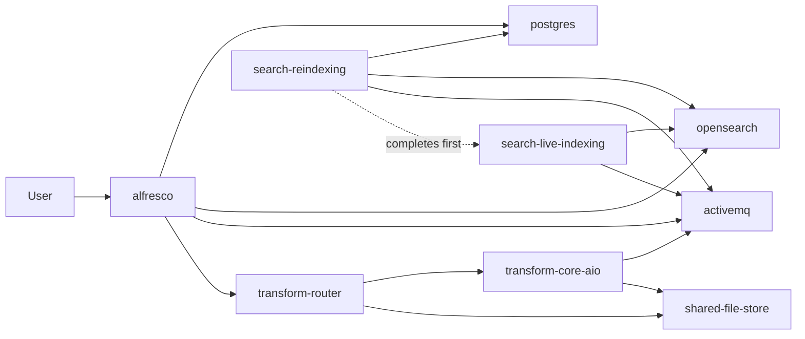

**Start**

```bash
docker compose --env-file .env -f stages/04-solr-search-with-ats/compose.yaml down
docker compose --env-file .env -f stages/05-opensearch-migration-with-ats/compose.yaml up
```

Validate DB and Repository (instructions above)

Validate Transform (instructions above)

Validate Search (new in this step: OpenSearch migration)

> After reindex completes, live indexing should be running

```bash
curl -H "Content-Type: application/json" \
  -d '{"query":{"match_all":{}},"size":1}' \
  "http://localhost:9200/alfresco/_search"
curl -u "admin:admin" \
  -H "Content-Type: application/json" \
  -d '{"query":{"query":"test"},"paging":{"maxItems":1,"skipCount":0}}' \
  "http://localhost:8080/alfresco/api/-default-/public/search/versions/1/search"
```

expected

```json
{ "hits": { "total": { "value": ..., ... }, "hits": [ ... ] } }
```

```json
{
  "list": {
    "pagination": { "count": ..., ... },
    "entries": [ ... ]
  }
}
```

### Step 6 - Stage 06 (Full Stack Without Proxy)

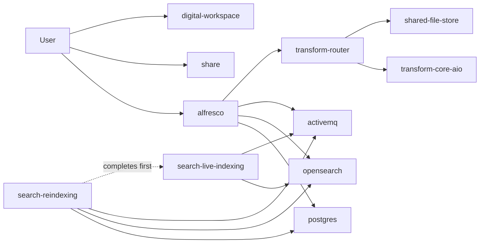

**Start**

```bash
docker compose --env-file .env -f stages/05-opensearch-migration-with-ats/compose.yaml down
docker compose --env-file .env -f stages/06-full-stack/compose.yaml up
```

Validate DB and Repository (instructions above)

Validate Search (instructions above)

Validate Transform (instructions above)

Validate UI (manual end-to-end)

1. Open `http://localhost:8081/` (ADW) in your browser.
2. Log in with credentials from `.env` (`ALFRESCO_ADMIN_USER` / `ALFRESCO_ADMIN_PASSWORD`, defaults usually `admin` / `admin`).
3. Upload a new text document with a unique word in its body (for example: `stage06-e2e-2026`).
4. Search in ADW for that unique word and open the returned document.
5. Optionally repeat in Share at `http://localhost:8082/share` to confirm same result.

expected

```text
Login works, upload succeeds, and full-text search returns the newly uploaded document.
This confirms repo, transform, messaging, and OpenSearch indexing are working together.
```

### Step 7 - Stage 07 (Add Reverse Proxy)

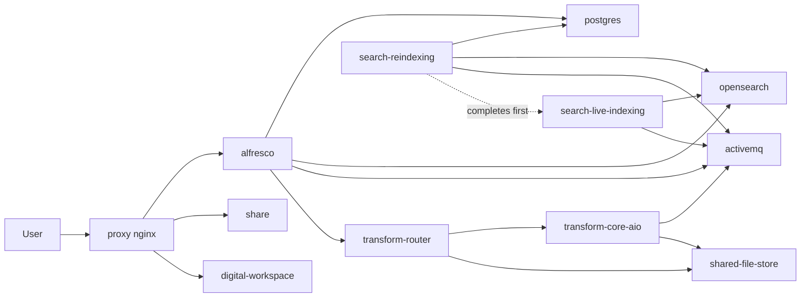

**Start**

```bash
docker compose --env-file .env -f stages/06-full-stack/compose.yaml down
docker compose --env-file .env -f stages/07-full-stack-proxy/compose.yaml up -d
```

Validate DB and Repository (instructions above)

Validate Search (instructions above, including OpenSearch API and Alfresco API)

Validate Transform (instructions above)

Validate UI (instructions above)

Validate Proxy (new in this step)

```bash
docker compose --env-file .env -f stages/07-full-stack-proxy/compose.yaml ps proxy
curl -f http://localhost:${PROXY_HTTP_PORT}/alfresco/api/-default-/public/alfresco/versions/1/probes/-ready-
curl -f http://localhost:${PROXY_HTTP_PORT}/workspace
curl -f http://localhost:${PROXY_HTTP_PORT}/share
```

expected

```text
proxy is Up and all routes respond through port ${PROXY_HTTP_PORT}
```

### Step 8 - Stage 08 (Best-Practice Runtime Controls)

> Docker Compose introduces [`deploy`](https://docs.docker.com/reference/compose-file/services/#deploy)/[`resources`](https://docs.docker.com/reference/compose-file/deploy/#resources), [`restart`](https://docs.docker.com/reference/compose-file/services/#restart), broader [`healthcheck`](https://docs.docker.com/reference/compose-file/services/#healthcheck) usage, [`depends_on`](https://docs.docker.com/reference/compose-file/services/#depends_on) with `service_healthy`, plus host/runtime directives [`command`](https://docs.docker.com/reference/compose-file/services/#command), [`ulimits`](https://docs.docker.com/reference/compose-file/services/#ulimits), and [`cap_add`](https://docs.docker.com/reference/compose-file/services/#cap_add).

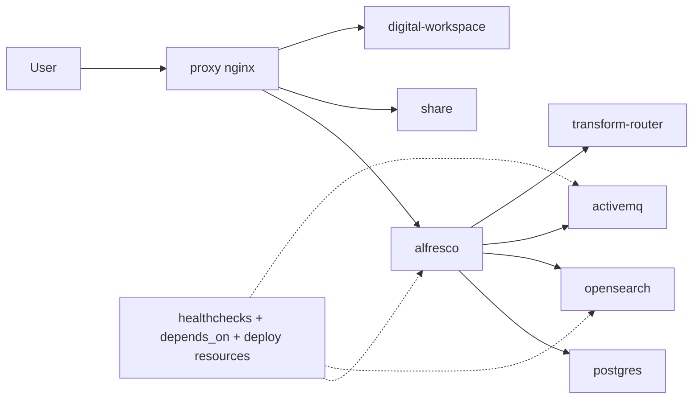

**Start**

```bash
docker compose --env-file .env -f stages/07-full-stack-proxy/compose.yaml down
docker compose --env-file .env -f stages/08-best-practices/compose.yaml up -d
```

Validate DB and Repository (instructions above)

Validate Search (instructions above, including OpenSearch API and Alfresco API)

Validate Transform (instructions above)

Validate UI and Proxy (instructions above)

Validate Runtime Controls (new in this step)

```bash
docker compose --env-file .env -f stages/08-best-practices/compose.yaml ps
docker compose --env-file .env -f stages/08-best-practices/compose.yaml ps | grep -E "healthy|running"
docker compose --env-file .env -f stages/08-best-practices/compose.yaml config | grep -En \
  "deploy:|resources:|healthcheck:|restart:|condition: service_healthy"
```

expected

```text
core services report healthy/running and compose config contains deploy/resources/healthcheck/restart/service_healthy directives
```

### Step 9 - Stage 09 (Install Addons)

> Docker Compose introduces [`build`](https://docs.docker.com/reference/compose-file/services/#build) ([`context`](https://docs.docker.com/compose/compose-file/build/#context), [`dockerfile`](https://docs.docker.com/compose/compose-file/build/#dockerfile), [`args`](https://docs.docker.com/compose/compose-file/build/#args)) for custom addon images.

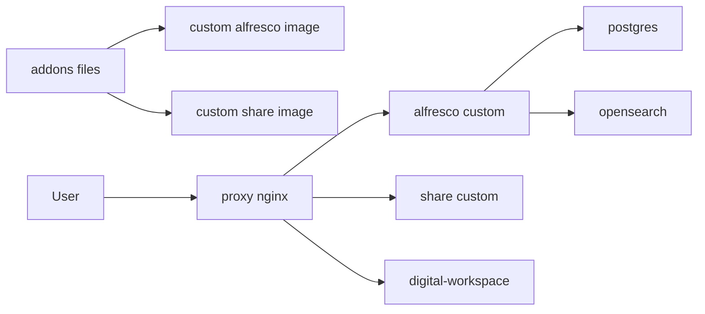

Follow [stages/09-addons/ADDONS.md](stages/09-addons/ADDONS.md), then:

**Start**

```bash
cd stages/09-addons
../../shared/fetch-addons.sh
cd ../..
docker compose --env-file .env -f stages/08-best-practices/compose.yaml down
docker compose --env-file .env -f stages/09-addons/compose.yaml up -d --build
```

Validate DB and Repository (instructions above)

Validate Search (instructions above, including OpenSearch API and Alfresco API)

Validate Transform (instructions above)

Validate UI and Proxy (instructions above)

Validate Addons Build (new in this step)

```bash
docker compose --env-file .env -f stages/09-addons/compose.yaml ps alfresco share
docker image ls --format '{{.Repository}}:{{.Tag}}' | grep -E \
  'local/alfresco-content-repository-addons|local/alfresco-share-addons'
```

expected

```text
alfresco/share are Up and local addon images are present
```

### Step 10 - Stage 10 (Restore On-Prem Data and Reindex)

> For real migrated data, install repository addon `model-ns-prefix-mapping` and
> generate `shared/reindex/reindex.prefixes-file.json` from
> `/alfresco/s/model/ns-prefix-map` before running reindexing.
> Addon source: https://github.com/AlfrescoLabs/model-ns-prefix-mapping

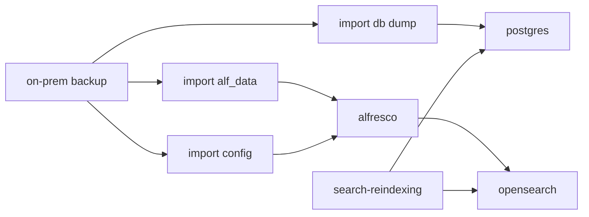

Use:

- [stages/10-restore-onprem/RESTORE.md](stages/10-restore-onprem/RESTORE.md)
- [stages/10-restore-onprem/ADDONS.md](stages/10-restore-onprem/ADDONS.md)
- [alfresco-ubuntu-installer backup/restore reference](https://github.com/aborroy/alfresco-ubuntu-installer/blob/main/README.md#backup-and-restore)

Then:

**Start**

```bash
docker compose --env-file .env -f stages/09-addons/compose.yaml down
docker compose --env-file .env -f stages/10-restore-onprem/compose.yaml up -d --build
```

Validate DB and Repository (instructions above)

Validate Search (instructions above, including OpenSearch API and Alfresco API)

Validate Transform (instructions above)

Validate UI and Proxy (instructions above)

Validate Restore Inputs (new in this step)

```bash
docker compose --env-file .env -f stages/10-restore-onprem/compose.yaml exec -T alfresco sh -c \
  'test -d /usr/local/tomcat/alf_data && test -d /usr/local/tomcat/shared/classes/alfresco/extension && echo "restore mounts present"'
test -s shared/reindex/reindex.prefixes-file.json && echo "prefix map generated"
docker compose --env-file .env -f stages/10-restore-onprem/compose.yaml ps search-reindexing search-live-indexing
```

expected

```text
restore mounts are present, prefix map file exists, reindexing runs/completes, and live indexing starts afterwards
```

### Step 11 - Stage 11 (Local Security Hardening)

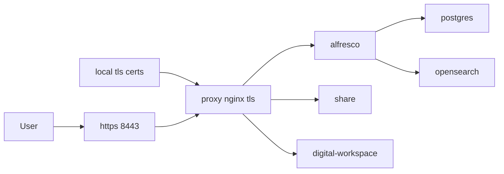

Use [stages/11-security-local/SECURITY.md](stages/11-security-local/SECURITY.md), then:

**Start**

```bash
cd stages/11-security-local
NGINX_SERVER_NAME=localhost ./generate-certs.sh
cd ../..
docker compose --env-file .env -f stages/10-restore-onprem/compose.yaml down
docker compose --env-file .env -f stages/11-security-local/compose.yaml up -d --build
```

Validate DB and Repository (instructions above)

Validate Search (instructions above, including OpenSearch API and Alfresco API)

Validate Transform (instructions above)

Validate UI and Proxy (instructions above)

Validate TLS Security (new in this step)

```bash
curl -k -f https://localhost:${PROXY_HTTPS_PORT}/alfresco/api/-default-/public/alfresco/versions/1/probes/-ready-
curl -I http://localhost:${PROXY_HTTP_PORT} | head -n 1
openssl s_client -connect localhost:${PROXY_HTTPS_PORT} -tls1_3
```

expected

```text
HTTPS probe succeeds, HTTP endpoint redirects, and TLS 1.3 handshake is established
```

### Step 12 - Stage 12 (Kubernetes Image Bakery Handoff)

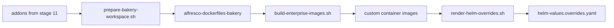

Use [stages/12-k8s-image-bakery/README.md](stages/12-k8s-image-bakery/README.md), then:

**Start**

```bash
cd stages/12-k8s-image-bakery
set -a; source ./bakery.env; set +a
./scripts/prepare-bakery-workspace.sh --bakery-dir "$BAKERY_DIR"
./scripts/build-enterprise-images.sh --env-file ./bakery.env
./scripts/render-helm-overrides.sh --env-file ./bakery.env
```

**Validate (Build artifacts for Kubernetes handoff)**

```bash
test -f ./helm-values.overrides.yaml && echo "helm overrides generated"
```

## Notes

- Stage 02 and Stage 03 isolate transform topology first (core-aio then ATS) before introducing search.
- Stage 04 introduces Solr search with ATS so students validate content search before migration.
- Stage 05 performs Solr to OpenSearch migration using reindex + live indexing.

## References

- [alfresco-incremental-deployment](https://github.com/aborroy/alfresco-incremental-deployment)
- [alfresco-docker-best-practices](https://github.com/aborroy/alfresco-docker-best-practices)
- [alfresco-opensearch-deployer](https://github.com/aborroy/alfresco-opensearch-deployer)
- [alfresco-ubuntu-installer](https://github.com/aborroy/alfresco-ubuntu-installer)
- [alfresco-extension-inspector](https://github.com/Alfresco/alfresco-extension-inspector)
- [alf-tengine-xml](https://github.com/aborroy/alf-tengine-xml)
- [alf-tengine-ocr](https://github.com/aborroy/alf-tengine-ocr)
- [alf-k8s](https://github.com/aborroy/alf-k8s)
- [alfresco-dockerfiles-bakery](https://github.com/Alfresco/alfresco-dockerfiles-bakery)
